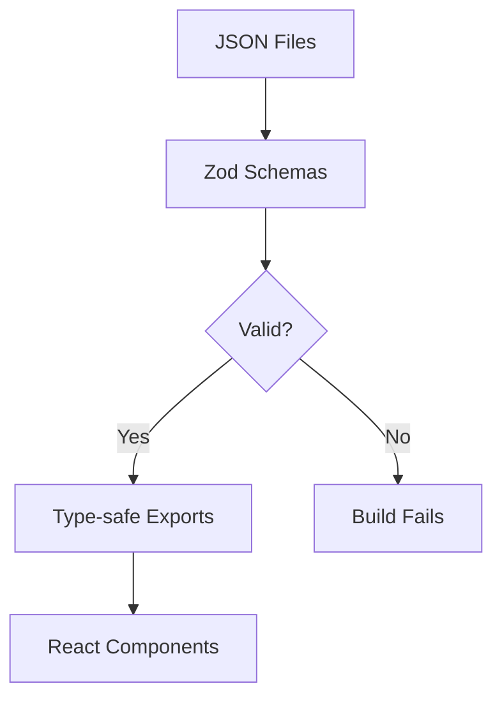

# Configuration System

The portfolio is driven by JSON configuration files validated at build time with Zod schemas.

## Configuration Files

| File                             | Purpose                                                    |
| -------------------------------- | ---------------------------------------------------------- |
| `src/config/site.json`           | Site metadata, navigation, social links, analytics         |
| `src/config/content.json`        | Portfolio content (hero, experience, skills, achievements) |
| `src/config/design-systems.json` | Design tokens for all visual themes                        |

## Validation Architecture



All JSON is validated at module load time (build time):

- Invalid configuration fails the build with descriptive errors
- Valid configuration exports type-safe objects for React
- No runtime validation overhead

## Schema Location

All Zod schemas are defined in `src/config/schema.ts`:

| Schema                      | Validates           |
| --------------------------- | ------------------- |
| `SiteConfigSchema`          | site.json           |
| `ContentConfigSchema`       | content.json        |
| `DesignSystemsConfigSchema` | design-systems.json |

## Loader Module

`src/config/loader.ts` handles:

1. **Validation** - Validates JSON against Zod schemas
2. **Template Processing** - Resolves `{{yearsSince:varName}}` syntax
3. **Skill Normalization** - Converts string skills to objects
4. **Metric Resolution** - Computes metric values from templates
5. **Type-safe Exports** - Provides typed config objects

### Exports

```typescript
import {
  hero, // Processed hero section
  metrics, // Resolved metric values
  experience, // Experience entries
  achievements, // Achievement entries
  skillCategories, // Normalized skills
  navLinks, // Navigation links
  contact, // Contact information
  sections, // Section order
} from '@/config/loader'
```

## site.json Structure

```json
{
  "meta": {
    "title": "Your Name - Portfolio",
    "description": "...",
    "keywords": ["..."]
  },
  "navigation": {
    "links": [{ "label": "About", "href": "#about" }]
  },
  "social": [
    { "platform": "linkedin", "url": "..." },
    { "platform": "email", "value": "..." }
  ],
  "features": {
    "jobBoard": false
  },
  "analytics": {
    "vercel": true
  }
}
```

## content.json Structure

```json
{
  "variables": {
    "careerStartYear": 1996
  },
  "hero": {
    "name": "Your Name",
    "title": "Your Title",
    "tagline": "{{yearsSince:careerStartYear}}+ years..."
  },
  "metrics": [...],
  "experience": [...],
  "skillCategories": [...],
  "achievements": [...],
  "sections": ["hero", "metrics", "experience", "skills", "achievements", "contact"]
}
```

See [Configuration Reference](../../src/config/README.md) for complete options.

## Template Variables

Dynamic year calculations using `{{yearsSince:varName}}`:

```json
{
  "variables": { "careerStartYear": 1996 },
  "hero": {
    "tagline": "{{yearsSince:careerStartYear}}+ years of experience"
  }
}
```

See [Template Variables](./template-variables.md) for details.

## Section Order

Control which sections appear and their order:

```json
{
  "sections": [
    "hero",
    "metrics",
    "experience",
    "skills",
    "achievements",
    "contact"
  ]
}
```

Omit a section ID to hide it.

## Generated Files

**Do not edit directly:**

| File                | Source                       | Command                 |
| ------------------- | ---------------------------- | ----------------------- |
| `index.html`        | `index.html.template` + JSON | `npm run generate:html` |
| `design-tokens.css` | `design-systems.json`        | `npm run generate:css`  |

Both are regenerated during `npm run build`.

## Error Handling

Validation errors provide specific feedback:

```
Error: Invalid content.json
  - hero.tagline: String must contain at least 10 characters
  - experience[0].company: Required
```

Fix the indicated fields and rebuild.

## TypeScript Types

Types are inferred from Zod schemas:

```typescript
import type {
  SiteConfig,
  ContentConfig,
  Experience,
  Achievement,
} from '@/config/schema'
```

## Extending Configuration

To add new config options:

1. Add field to JSON file
2. Update Zod schema in `schema.ts`
3. Add processing logic in `loader.ts` if needed
4. Export for component use
