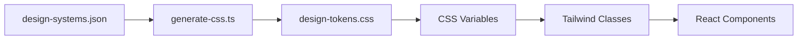

# Design Systems Architecture

The portfolio supports multiple visual themes through a JSON-driven design token system.

## Available Design Systems

| ID           | Name                   | Aesthetic                        |
| ------------ | ---------------------- | -------------------------------- |
| `corporate`  | Corporate Professional | Navy & Brass, refined shadows    |
| `hand-drawn` | Hand-Drawn Sketch      | Paper & pencil, wobbly borders   |
| `automotive` | Automotive Industrial  | Neumorphic, Dieter Rams inspired |
| `bauhaus`    | Bauhaus Geometric      | Constructivist, primary colors   |

## How It Works



1. Design tokens defined in `src/config/design-systems.json`
2. Build script generates CSS variables
3. Tailwind uses semantic color classes
4. Components adapt automatically per theme

## Token Structure

```json
{
  "defaultSystem": "corporate",
  "defaults": {
    "spacing": { ... },
    "typography": { ... },
    "animation": { ... }
  },
  "systems": [
    {
      "id": "corporate",
      "name": "Corporate Professional",
      "supportsDarkMode": true,
      "fonts": { ... },
      "tokens": {
        "light": { ... },
        "dark": { ... }
      }
    }
  ]
}
```

### Defaults

Shared values across all design systems:

| Section      | Purpose                       |
| ------------ | ----------------------------- |
| `spacing`    | Base unit and scale           |
| `typography` | Font size scale, line heights |
| `animation`  | Duration and easing presets   |
| `layout`     | Max widths, section padding   |

### System Tokens

Each design system defines:

| Token        | Purpose                                               |
| ------------ | ----------------------------------------------------- |
| `fonts`      | Display, body, mono with Google Fonts URLs            |
| `colors`     | Semantic palette (background, foreground, card, etc.) |
| `shadows`    | sm, md, lg, xl, card, card-hover, button              |
| `radius`     | sm, md, lg, xl, 2xl, card, button, badge              |
| `border`     | Width and style                                       |
| `decorative` | Theme-specific effects (rotation, texture)            |

## Dark Mode Support

Each system can define separate `light` and `dark` tokens:

```json
{
  "tokens": {
    "light": {
      "colors": { "background": "#f8fafc", ... }
    },
    "dark": {
      "colors": { "background": "#0c1a2a", ... }
    }
  }
}
```

Set `supportsDarkMode: true` to enable theme switching.

## Design System Inheritance

Systems can extend others using the `extend` property:

```json
{
  "id": "custom",
  "extend": "corporate",
  "tokens": {
    "light": {
      "colors": { "accent": "#ff6b6b" }
    }
  }
}
```

Only override what differs. Single-level inheritance only.

## Adding a New Design System

1. Add entry to `src/config/design-systems.json`:

```json
{
  "id": "minimal",
  "name": "Minimal Clean",
  "supportsDarkMode": true,
  "fonts": {
    "display": { "family": "Inter", "fallback": "system-ui" },
    "body": { "family": "Inter", "fallback": "system-ui" },
    "mono": { "family": "JetBrains Mono", "fallback": "monospace" }
  },
  "tokens": {
    "light": { ... },
    "dark": { ... }
  }
}
```

2. Regenerate CSS tokens:

```bash
npm run generate:css
```

3. (Optional) Add decorative CSS in `src/styles/design-systems/minimal.css`

4. Import decorative CSS in `src/index.css`:

```css
@import './styles/design-systems/minimal.css';
```

## Semantic Color Classes

Components use semantic Tailwind classes that adapt per design system:

| Class                   | Purpose          |
| ----------------------- | ---------------- |
| `bg-background`         | Page background  |
| `bg-card`               | Card backgrounds |
| `text-foreground`       | Primary text     |
| `text-muted-foreground` | Secondary text   |
| `border-border`         | Default borders  |
| `bg-primary`            | Primary actions  |
| `bg-accent`             | Accent/highlight |

## Design-Aware Utilities

Custom utilities that use design system tokens:

| Utility              | CSS Variable               | Usage                |
| -------------------- | -------------------------- | -------------------- |
| `.rounded-card`      | `var(--radius-card)`       | Card border radius   |
| `.rounded-button`    | `var(--radius-button)`     | Button border radius |
| `.shadow-card`       | `var(--shadow-card)`       | Card shadow          |
| `.shadow-card-hover` | `var(--shadow-card-hover)` | Card hover shadow    |
| `.border-ds`         | `var(--border-width)`      | Design system border |

## Runtime Switching

The active design system is controlled by a `data-design-system` attribute on `<html>`:

```html
<html data-design-system="corporate" class="dark"></html>
```

Users can switch via:

- URL parameter: `?design=hand-drawn`
- Theme chooser FAB panel
- Keyboard: Design system toggle

## Decorative CSS

Each design system can have additional decorative styles in `src/styles/design-systems/`:

- `corporate.css` - Professional refinements
- `hand-drawn.css` - Wobbly borders, paper texture
- `automotive.css` - Neumorphic shadows, industrial feel
- `bauhaus.css` - Geometric shapes, dot grid background

These provide visual enhancements beyond the token system.

## Generated Files

**Do not edit directly:**

- `src/config/generated/design-tokens.css` - Generated from `design-systems.json`

Regenerate after changing design tokens:

```bash
npm run generate:css
```
