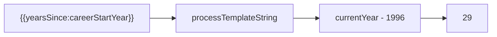

# Template Variables

Template variables enable dynamic content calculations, such as automatically updating years of experience.

## Syntax

```
{{yearsSince:variableName}}
```

Calculates: `currentYear - variableValue`

## Defining Variables

In `content.json`, define variables in the `variables` object:

```json
{
  "variables": {
    "careerStartYear": 1996,
    "partnershipStartYear": 2013,
    "companyFoundedYear": 2018
  }
}
```

## Using Variables

Reference variables anywhere in content strings:

```json
{
  "hero": {
    "tagline": "{{yearsSince:careerStartYear}}+ years of engineering excellence"
  },
  "experience": [
    {
      "highlights": [
        "{{yearsSince:partnershipStartYear}} years as certified partner"
      ]
    }
  ]
}
```

## Processing Flow



1. Template pattern detected in string
2. Variable name extracted
3. Current year minus variable value
4. Result substituted into string

## Supported Locations

Template variables work in:

| Location                             | Example                                                  |
| ------------------------------------ | -------------------------------------------------------- |
| `hero.tagline`                       | `"{{yearsSince:careerStartYear}}+ years..."`             |
| `hero.badge.value`                   | `"{{yearsSince:careerStartYear}}"`                       |
| `hero.valuePills[].label`            | `"{{yearsSince:careerStartYear}}+ Years"`                |
| `hero.quickStats[].value`            | `"{{yearsSince:careerStartYear}}"`                       |
| `metrics[].value`                    | `"{{yearsSince:careerStartYear}}"`                       |
| `metrics[].backContent`              | All string fields                                        |
| `experience[].highlights`            | `"{{yearsSince:partnershipStartYear}} year partnership"` |
| `achievements[].summary`             | `"Spanning {{yearsSince:domainStartYear}} years"`        |
| `skillCategories[].skills[].context` | `"{{yearsSince:skillStartYear}} years with..."`          |
| `site.meta.description`              | `"{{yearsSince:careerStartYear}}+ years experience..."`  |

## Metric Values

Metrics support both number and template string values:

```json
{
  "metrics": [
    { "value": 25, "label": "Projects" },
    {
      "value": "{{yearsSince:careerStartYear}}",
      "suffix": "+",
      "label": "Years Experience"
    }
  ]
}
```

Template values are resolved to numbers for animated counters.

## Error Handling

### Unknown Variable

```json
{ "tagline": "{{yearsSince:unknownVar}}+ years" }
```

Error:

```
Unknown template variable "unknownVar". Available variables: careerStartYear, partnershipStartYear
```

### Invalid Metric Value

```json
{ "value": "{{yearsSince:textValue}}", "label": "Count" }
```

If `textValue` isn't a year, error:

```
Invalid metric value: "{{yearsSince:textValue}}" resolved to "NaN" which is not a number.
```

## Implementation

Template processing is handled in `src/config/loader.ts`:

```typescript
// Process a single template string
export function processTemplateString(
  str: string,
  variables: Record<string, number>
): string {
  return str.replace(/\{\{yearsSince:(\w+)\}\}/g, (_match, varName) => {
    const startYear = variables[varName]
    if (startYear === undefined) {
      throw new Error(`Unknown template variable "${varName}"`)
    }
    return String(currentYear - startYear)
  })
}

// Recursively process all strings in an object
export function processTemplates<T>(
  obj: T,
  variables: Record<string, number>
): T
```

## Best Practices

1. **Use descriptive names**: `careerStartYear` not `year1`
2. **Document variables**: Add comments in your content.json
3. **Test edge cases**: Verify output for year boundaries
4. **Keep it simple**: Only use for year calculations

## Adding New Variable Types

Currently only `yearsSince` is supported. To add new types:

1. Update regex in `processTemplateString()`
2. Add new calculation logic
3. Update Zod schema if needed
4. Document the new syntax
