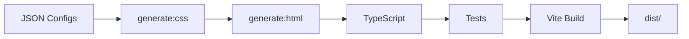

# Quick Start Guide

Get your portfolio up and running in 5 minutes.

## Prerequisites

- Node.js 20+
- npm

## Alternative: Import from PDF Resume

Have a PDF resume? Skip manual editing and auto-generate your portfolio:

```bash
npm run resume:import -- resume.pdf my-portfolio
npm run portfolio:switch my-portfolio
```

Requires [Claude Code](https://code.claude.com/docs/en/overview). See [PDF Import Guide](../pdf-import/guide.md) for details.

## Create Your Portfolio

### 1. Use This Template

**Option A: GitHub Template (Recommended)**

Click the green **"Use this template"** button at the top of the repository, then select **"Create a new repository"**. This creates a clean copy without the original commit history.

```bash
# Clone your new repository
git clone https://github.com/YOUR_USERNAME/portfolio-template.git
cd portfolio-template
```

**Option B: Fork**

Alternatively, fork the repository if you want to receive future updates:

```bash
# Fork this repo on GitHub, then clone your fork
git clone https://github.com/YOUR_USERNAME/portfolio-template.git
cd portfolio-template
```

### 2. Install Dependencies

```bash
npm install
```

### 3. Edit Your Content

Edit these JSON files to customize your portfolio:

| File                      | Purpose                                     |
| ------------------------- | ------------------------------------------- |
| `src/config/content.json` | Your info, experience, skills, achievements |
| `src/config/site.json`    | Site metadata, navigation, social links     |

Replace your profile photo:

```bash
# Replace with your photo (recommended: 400x400px)
cp /path/to/your-photo.jpg public/profile.jpg
```

### 4. Run Locally

```bash
npm run dev
```

Open [http://localhost:5173](http://localhost:5173) to see your portfolio.

### 5. Deploy

**Vercel (Recommended)**

```bash
# Install Vercel CLI
npm i -g vercel

# Deploy
vercel
```

Or connect your GitHub repo to [Vercel](https://vercel.com) for automatic deployments.

See [Deployment Guide](./deployment.md) for Docker and other options.

## What's Next?

- [Customize Design Systems](../architecture/design-systems.md) - Switch between Corporate, Hand-Drawn, Automotive, Bauhaus
- [Template Variables](../architecture/template-variables.md) - Auto-calculate years of experience
- [Configuration Reference](../../src/config/README.md) - Full JSON configuration options
- [Environment Variables](./environment-variables.md) - Enable/disable features

## Portfolio Examples

Test different portfolio configurations for various roles:

```bash
npm run portfolio:list              # List available examples
npm run portfolio:switch dev-senior # Switch to senior developer example
npm run portfolio:reset             # Restore original config
```

Available examples:

- `dev-intern`, `dev-senior` - Developer roles
- `ux-designer`, `ux-lead` - UX/Design roles
- `marketing-product`, `marketing-demand-gen` - Marketing roles
- `hr-assistant`, `hr-manager` - HR roles

## Build Pipeline



The build process:

1. Generates CSS tokens from `design-systems.json`
2. Generates `index.html` from template + JSON configs
3. Type-checks with TypeScript
4. Runs tests with Vitest
5. Bundles for production with Vite
