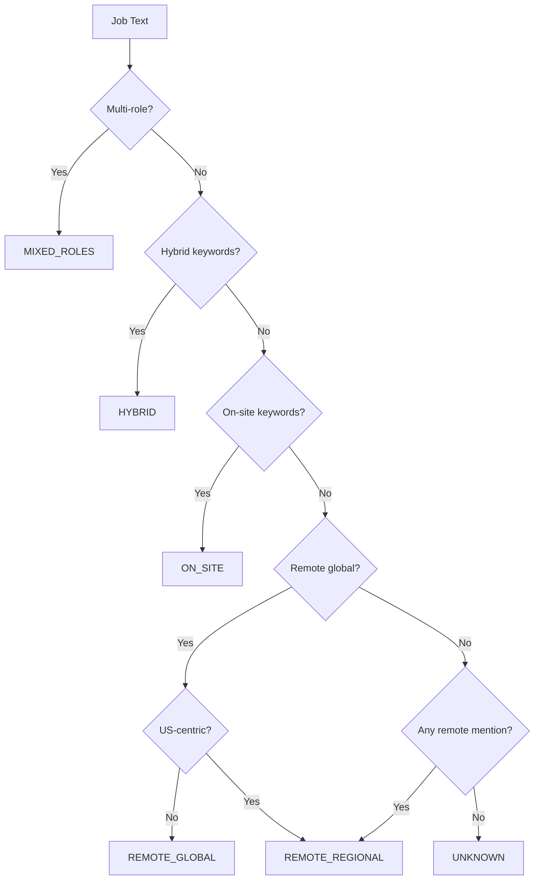

# Location Classification System

The job board classifies jobs by location type for filtering.

**Source:** `src/lib/skillMatcher.ts`

## Location Types

| Type              | Description                             | Example                          |
| ----------------- | --------------------------------------- | -------------------------------- |
| `REMOTE_GLOBAL`   | Worldwide remote, no restrictions       | "Remote - work from anywhere"    |
| `REMOTE_REGIONAL` | Remote with region restrictions         | "Remote (EU only)"               |
| `HYBRID`          | Partially remote, some on-site          | "Hybrid - 2 days in office"      |
| `ON_SITE`         | Physical location required              | "On-site in London"              |
| `MIXED_ROLES`     | Multiple roles with different locations | "Senior (remote) / Junior (NYC)" |
| `UNKNOWN`         | No clear location signals               | Ambiguous postings               |

## Filter Options

The job board provides these filter presets:

| Filter          | Matches                                                 |
| --------------- | ------------------------------------------------------- |
| All Locations   | Everything                                              |
| Remote (Global) | `REMOTE_GLOBAL` only                                    |
| Remote (EU)     | `REMOTE_GLOBAL` + `REMOTE_REGIONAL` where EU is primary |
| On-site (EU)    | `ON_SITE` + `HYBRID` with EU locations                  |
| Any (EU)        | All jobs available to EU-based candidates               |

## Classification Flow



## Detection Patterns

### Remote Global Patterns

Phrases indicating worldwide availability:

- "work from anywhere"
- "100% remote"
- "fully remote"
- "remote first"
- "remote worldwide"
- "location: remote"

### Regional Restrictions

Patterns that indicate region-specific remote:

- "Remote (US only)"
- "Remote - EU timezone"
- "Remote, Americas"
- Timezone requirements: "EST hours", "CET required"

### US-Centric Detection

Jobs that appear US-focused even without explicit restriction:

- Multiple US cities listed
- USD salary without international mention
- US timezone requirements
- Security clearance mentions
- References to US-specific benefits

### On-Site Patterns

- "on-site required"
- "in-office"
- "not remote"
- "relocation provided"
- Specific city without remote mention

### Hybrid Patterns

- "hybrid"
- "X days in office"
- "remote-friendly"
- "flexible work"

## Region Mapping

Countries are mapped to regions:

| Region   | Countries                                     |
| -------- | --------------------------------------------- |
| EU       | Germany, France, UK, Netherlands, Spain, etc. |
| Americas | USA, Canada, Brazil, Mexico, etc.             |
| APAC     | Australia, Japan, Singapore, India, etc.      |
| MENA     | UAE, Israel, Egypt, Saudi Arabia, etc.        |
| Global   | No restriction                                |

## Key Functions

| Function                    | Purpose                                         |
| --------------------------- | ----------------------------------------------- |
| `classifyJobLocation()`     | Main entry point - returns `ParsedLocationData` |
| `isRemoteJob()`             | Check if job mentions remote                    |
| `isExplicitlyUSOnly()`      | Detect explicit US restrictions                 |
| `appearsUSCentric()`        | Heuristic US-focused detection                  |
| `analyzeLocationPriority()` | Extract primary/secondary regions               |
| `extractOnSiteLocations()`  | Find specific location mentions                 |
| `detectMultiRolePost()`     | Check for multiple roles in one post            |

## ParsedLocationData

Return type from `classifyJobLocation()`:

```typescript
interface ParsedLocationData {
  type:
    | 'REMOTE_GLOBAL'
    | 'REMOTE_REGIONAL'
    | 'HYBRID'
    | 'ON_SITE'
    | 'MIXED_ROLES'
    | 'UNKNOWN'
  primaryRegions: Region[] // Main target regions
  secondaryRegions: Region[] // Also mentioned regions
  onSiteLocations: string[] // Specific cities/offices
  excludedRegions: Region[] // Explicitly excluded
  confidence: 'high' | 'medium' | 'low'
  roleBreakdown?: {
    // For MIXED_ROLES
    remoteRoles: number
    onSiteRoles: number
  }
}
```

## Filter Functions

```typescript
// Only truly global remote jobs
isRemoteJobGlobal(locationData: ParsedLocationData): boolean

// Remote jobs available in EU
isRemoteJobAvailableInEU(locationData: ParsedLocationData): boolean

// Check if job is available in specific region
isRemoteJobAvailableInRegion(
  locationData: ParsedLocationData,
  userRegion: Region
): boolean
```

## Known Limitations

1. **Implicit restrictions**: Some jobs don't state restrictions explicitly
2. **Multi-role ambiguity**: Complex posts with many roles may be misclassified
3. **Salary-based inference**: USD-only salary may not always mean US-only
4. **Timezone overlap**: EU-friendly timezones may include non-EU countries

See [Filter Tests](../job-board/filter-tests.md) for known edge cases.

## Usage

```typescript
import {
  classifyJobLocation,
  isRemoteJobAvailableInEU,
} from '@/lib/skillMatcher'

const locationData = classifyJobLocation(jobText)

if (isRemoteJobAvailableInEU(locationData)) {
  // Job is available for EU-based applicants
}
```

## See Also

- [Skill Matcher](./skill-matcher.md) - Skill matching algorithm
- [Job Board Architecture](../job-board/architecture.md) - Overall design
