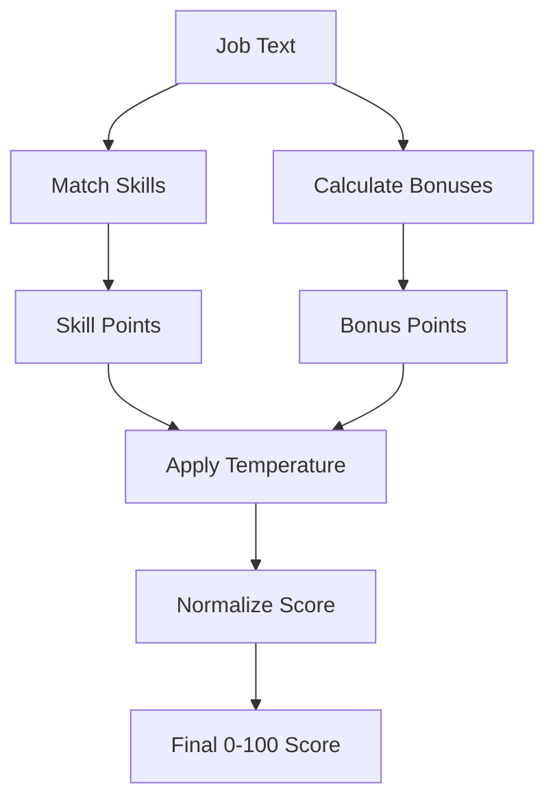

# Skill Matching Algorithm

The job board uses a temperature-based weighted scoring algorithm to match jobs against your skills.

**Source:** `src/lib/skillMatcher.ts`

## Overview



## Core Concepts

### Weighted Skills

Skills are weighted by importance (1-10 scale) in `content.json`:

```json
{
  "skillCategories": [
    {
      "name": "Languages",
      "skills": [
        { "name": "TypeScript", "weight": 10 },
        { "name": "Python", "weight": 7 }
      ]
    }
  ]
}
```

Default weight: 5 (configurable via `jobBoardScoring.defaultSkillWeight`)

### Skill Aliases

Skills can have aliases for flexible matching:

```json
{
  "name": "Node.js",
  "weight": 9,
  "aliases": ["node", "nodejs", "node.js"]
}
```

## Temperature Control

Temperature (0.0-1.0) controls matching strictness:

| Range   | Mode        | Weight Effect            | Bonus Effect   | Use Case               |
| ------- | ----------- | ------------------------ | -------------- | ---------------------- |
| 0.0-0.2 | Strict      | Squared (amplified)      | 50% reduced    | Precise matching       |
| 0.3-0.5 | Balanced    | Linear (1:1)             | Full value     | Default                |
| 0.6-0.8 | Exploratory | Square root (compressed) | 125% amplified | Discover opportunities |
| 0.9-1.0 | Loose       | Nearly equal             | 200% doubled   | Show everything        |

### Temperature Effects

**Strict (0.1):**

- High-weight skills dominate scoring
- Bonuses matter less
- Only precise matches score well

**Balanced (0.4):**

- Linear weight application
- Standard bonus values
- Good balance of precision and discovery

**Exploratory (0.7):**

- Weight differences compressed
- Bonuses have more impact
- More jobs reach threshold

**Loose (0.95):**

- All skills weighted nearly equally
- Bonuses doubled
- Maximum job visibility

## Score Components

### Skill Points

For each matched skill:

```
adjustedWeight = skill.weight ^ temperatureFactors.weightExponent
skillPoints += adjustedWeight
```

### Bonus Points

| Bonus            | Default Points | Trigger                           |
| ---------------- | -------------- | --------------------------------- |
| Remote Position  | 15             | Job mentions "remote"             |
| Region Friendly  | 10             | Remote available in user's region |
| Seniority Match  | 20             | Job matches seniority keywords    |
| Domain Relevance | 15             | Job mentions relevant domains     |

Bonuses are multiplied by `temperatureFactors.bonusMultiplier`.

### Max Possible Points

Uses top-N skills (skill ceiling) rather than all skills:

```
maxPoints = sum(topN skills by weight, each ^ weightExponent) + maxBonuses
```

Skill ceiling adjusts with temperature:

- Strict: fewer skills considered
- Loose: more skills considered

## Final Score Calculation

```
rawScore = (skillPoints + bonusPoints) / maxPossiblePoints
curvedScore = rawScore ^ scoreCurveExponent
finalScore = curvedScore * 100
```

## Configuration

In `content.json` under `jobBoardScoring`:

```json
{
  "jobBoardScoring": {
    "defaultSkillWeight": 5,
    "bonuses": {
      "remotePosition": 15,
      "regionFriendly": 10,
      "seniorityMatch": 20,
      "domainRelevance": 15
    },
    "relevantDomains": ["fintech", "automotive"],
    "seniorityKeywords": ["senior", "staff", "principal", "lead"],
    "skillCeiling": {
      "baseSkillCount": 8,
      "temperatureSensitivity": 0.6,
      "minSkillCount": 4,
      "maxSkillCount": 12
    },
    "scoreWeights": {
      "skills": 0.65,
      "bonuses": 0.35
    }
  }
}
```

### Configuration Options

| Option                        | Default       | Purpose                                   |
| ----------------------------- | ------------- | ----------------------------------------- |
| `defaultSkillWeight`          | 5             | Weight for skills without explicit weight |
| `bonuses.*`                   | varies        | Point values for each bonus type          |
| `relevantDomains`             | []            | Companies/domains for domain bonus        |
| `seniorityKeywords`           | ["senior"...] | Keywords for seniority detection          |
| `skillCeiling.baseSkillCount` | 8             | Base number of skills for max calculation |
| `scoreWeights.skills`         | 0.65          | Weight of skill points in final score     |
| `scoreWeights.bonuses`        | 0.35          | Weight of bonus points in final score     |

## Key Functions

| Function                        | Purpose                                          |
| ------------------------------- | ------------------------------------------------ |
| `calculateWeightedScore()`      | Main entry point - returns `WeightedMatchResult` |
| `calculateTemperatureFactors()` | Compute adjustment factors from temperature      |
| `calculateSkillPoints()`        | Match skills and compute weighted points         |
| `calculateBonusPoints()`        | Compute bonus points based on job attributes     |
| `calculateMaxSkillPoints()`     | Determine maximum possible skill points          |
| `matchJobToSkills()`            | Simple matching (backward compatible)            |

## Usage

```typescript
import { calculateWeightedScore } from '@/lib/skillMatcher'

const result = calculateWeightedScore(
  jobText, // Job posting text
  'EU', // User region
  0.4 // Temperature (0.0-1.0)
)

console.log(result.score) // 0-100 final score
console.log(result.matchedSkills) // Matched skill details
console.log(result.bonuses) // Which bonuses applied
```

## See Also

- [Location Classification](./location-classification.md) - How jobs are categorized by location
- [Job Board Architecture](../job-board/architecture.md) - Overall job board design
